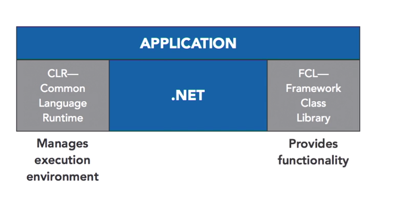
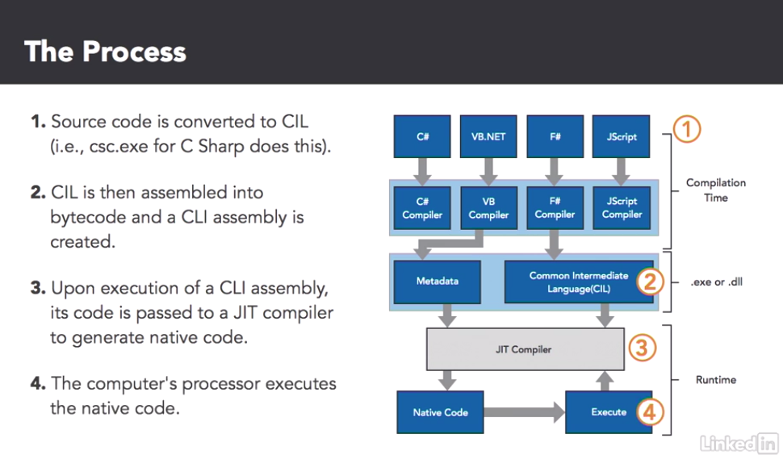

## Common Language Runtime

**Services**

* Ensure Program works correctly
* Supports Multiple Languages

**Framework Class Library**

Interacted with the most, This provides Functions and interfaces that allow ease of

* Data Structure Encapsulation
* .Net Framework Securtiy Checks
* Read and Writing to Disks

Composed of many elements

* Desktop apps
* Mobile apps
* Web Applications
* Web Services

**High Level Overview**

CLR Manages the Execution Environment

FCL - Provides functions and ease for the developer to develope functional applications with .NET

## The Compilers

